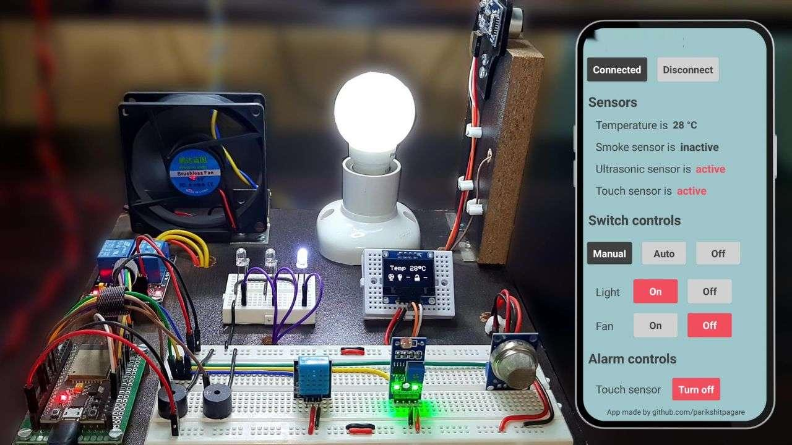
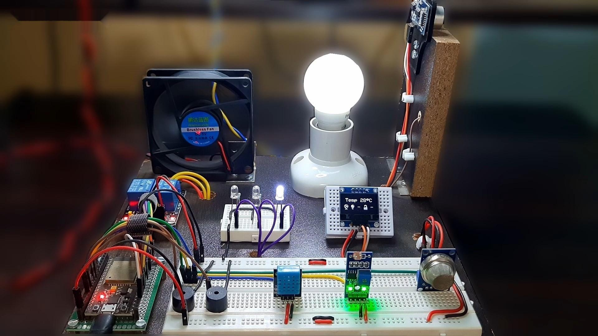
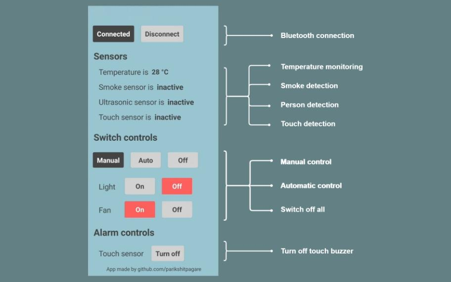
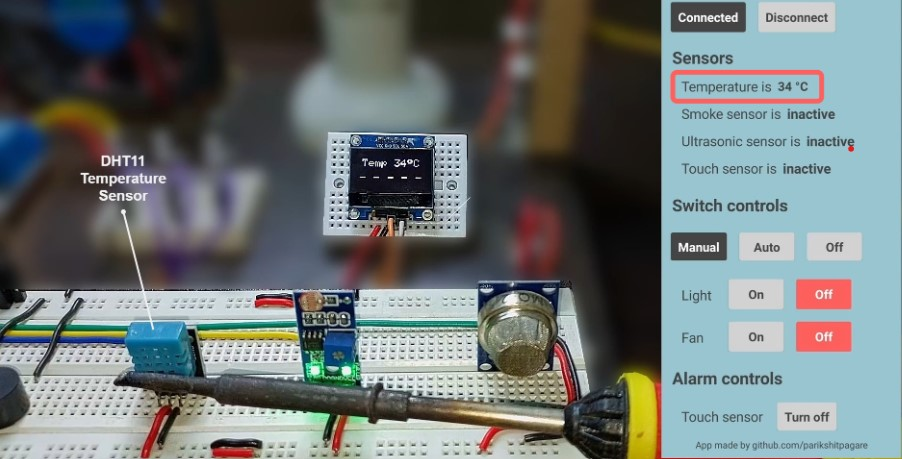
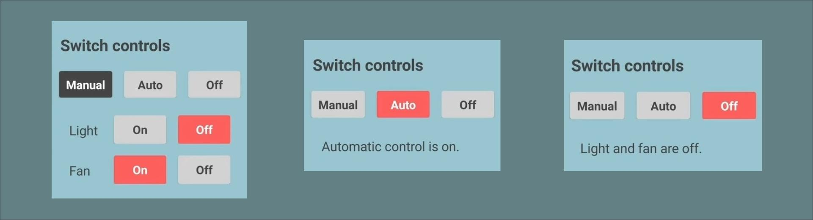

  

   
   
   

Home automation system developed on ESP32 microcontroller using freeRTOS with smart features. The entire system is controlled wirelessly via Bluetooth with a dedicated Android app.

&nbsp;

	

## Recognition
- Showcased on **Hackaday** - [Tiny Microcontroller Uses Real-Time Operating System](https://hackaday.com/2023/05/10/tiny-microcontroller-uses-real-time-operating-system/)

## About 'Smart Home Automation'

When we think of home automation we generally visualize switching on/off some buttons, temperature monitoring, etc. 

> *It is not smart automation in true sense*

- To achieve true home automation Real Time Operating System (RTOS) is integrated in the system which can perform multiple things simultaneously.
- The system is smart enough to automatically trigger actions based on certain events happening in real time.

## Features

- Wireless control with Bluetooth
- Dedicated Android app
- Activity monitoring on OLED display and app
- Temperature sensing using DHT11 sensor
- Light intensity sensing using LDR
- Fan/Light control in 3 modes - manual, automatic (based on sensors) and off
- Person detection at door using ultrasonic sensor
- Touch detection on door with alarm using ESP32 inbuilt touch sensor
- Smoke detection with alarm using MQ2 sensor

## Hardware

### System Overview

- The entire system is custom made with wiring and placements planned according to requirements.
- It is developed to resemble a room in a house.

	

### Requirements

- ESP32 Microcontroller
- DHT11 Temperature and Humidity sensor
- LDR module
- MQ2 Gas/Smoke Sensor
- Ultrasonic Sensor
- OLED display
- Relay
- Buzzers
- Leds
- Bulb
- DC fan

### Schematic

Components can be assembled and connected as shown in the schematic.

	

## Software  

To program the microcontroller **Arduino IDE** is used which is compatible with ESP32. 

### How to connect ESP32 with Arduino IDE?

- Download and install the Arduino IDE
- Install the ESP32 Library at `File -> Preference -> Additional Boards Manager URLs:` https://raw.githubusercontent.com/espressif/arduino-esp32/gh-pages/package_esp32_index.json
- Then in the `Tools -> Board Manager` -> search for ESP32 and install

### Libraries 

Certain libraries are required for proper functioning of the microcontroller and interfaced components.

- [Bluetooth Serial](https://github.com/espressif/arduino-esp32/tree/master/libraries/BluetoothSerial)
- [Wire](https://github.com/esp8266/Arduino/blob/master/libraries/Wire/)
- [DHT](https://github.com/adafruit/DHT-sensor-library)
- [Adafruit_SSD1306](https://github.com/adafruit/Adafruit_SSD1306)
- [Adafruit_GFX](https://github.com/adafruit/Adafruit-GFX-Library)
- [Ticker](https://github.com/espressif/arduino-esp32/tree/master/libraries/Ticker)

### Real Time Operating System

- Another important software required is **freeRTOS** which is responsible for real time functioning of components present in the system.
- ESP32 supports freeRTOS out of the box in Arduino IDE with its own flavour on the top of original for proper integration.

### Android App

The Android app is developed on [MIT App Inventor](https://appinventor.mit.edu/) platform.

	

## Working

### Connecting to App

- Connect/Disconnect button is provided in the app to connect with the system via Bluetooth.
- There is no external bluetooth module used as the ESP32 microcontroller has one builtin.

	

 

### Activity Monitoring

- All the sensor activity and switch controls are monitored on OLED display that is interfaced using I2C communication protocol.
- The same is monitored on the android app.

	

 

### Temperature and Light Sensing

- DHT11 digital sensor is used to sense temperature in the room and it is monitored on App/OLED.
- Light intensity in the room is sensed using a LDR (Light Dependent Resistor) module. This is used for automatic switching of bulb as explained later.

	

 

### Safety System

- For safety purpose, a smoke detection unit is implemented with MQ2 sensor which activates a buzzer and Led in presence of smoke. 
- The buzzer turns off automatically once the smoke disappears.

### Security System 

A security system is implemented on the door using Ultrasonic and Touch sensors.

#### Person Detection

- If a person comes in the range of ultrasonic sensor mounted on the door, the App/OLED displays presence of the person and Led turns on to notify the same.

#### Touch Detection

- If a person touches the door handle a buzzer is activated and App/OLED displays presence of touch along with an Led indicator. 
- It can be deactivated by pressing the turn off button on app.
- Touch sensing is implemented using ESP32 inbuilt touch sensor.

### Fan/Light Control

The fan/bulb is operated in 3 modes using relays,

#### Manual Mode 

- Buttons on the App are used to manually switch on/off the bulb and fan.

#### Automatic Mode 

- Automated switching of fan and light based on temperature monitored by DHT11 sensor and light intensity measured by LDR (Light Dependent Resistor) respectively is implemented.
- The fan automatically turns on when the temperature crosses threshold value of 33°C and turns off when it falls below the threshold.
- Based on the lighting conditions in the room sensed by LDR, the bulb turns on automatically when light intensity falls below certain threshold and vice versa.

#### Off Mode 

- Everything can be switched off at once with one button on the app when leaving the room.

## Creator

**Shaik Mudassir Nawaz**

